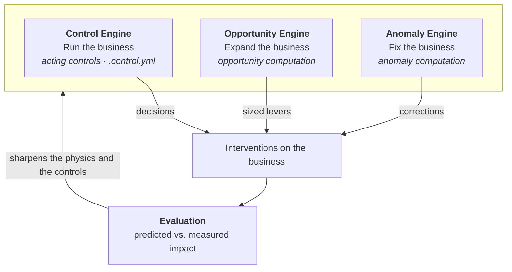

Where the World Model's [physics layer](/guide/build/world-model) describes
what the business is, **controls** describe how you keep it on course. A
control codifies a standing operating practice, such as "reorder before a SKU
runs out," "flag any store whose sales break from pattern," or "surface any
store lagging its peers," as a single primitive:

> **Criteria** state when to act, and an **action** states what to do.

Every business already runs on controls, even if only a few of them are
written down as SOPs and most live in a spreadsheet someone opens weekly or
in a single operator's head. Codifying them makes each one a first-class
citizen of the World Model: declared in a version-controlled `.control.yml`
file, attached to the measures it reads and the actions it takes, rendered on
the World Model graph, and measurable. A proposed change to how you operate
can be [backtested against your own history](/guide/build/world-model/evaluation)
before anyone commits to it, and measured once it is in place.

The term draws on two traditions, and both of them apply. In control theory,
a control loop is a reference, a comparator, and an actuator regulating a
plant, and since you cannot design or test a controller without a model of
the plant, the World Model supplies that model. In audit practice, a control
is a codified practice with an objective, an owner, and periodic testing,
which is exactly what these files are.

## Two parts

Every control consists of the same two declarations:

| Part | The question it answers | Vocabulary |
| --- | --- | --- |
| `criteria` | When should this control act? | A first-class computation over the World Model: an anomaly, an opportunity, or a trigger |
| `action` | What does it do? | **Inform** people, or **act** on the business, carried out by a person or by an [automation](/guide/build/automations) |

## Criteria are first-class computations

Criteria are not free-form conditions. Each one is a named computation with
its own semantics, built on the physics layer in the same way that
thermodynamics builds engines and refrigerators from the same underlying
laws. Oxygen ships three of them:

| `type` | The computation | Properties |
| --- | --- | --- |
| `anomaly` | Deviation from this measure's own forecast, statistically gated | `measure`, `grain`, `significance` |
| `opportunity` | Gap versus a peer benchmark, sized in dollars and statistically gated | `measure`, `against`, `significance`, `min_impact` |
| `trigger` | A declared condition on measures | `when` |

The computation is where the rigor lives: `anomaly` carries the seasonal
model and the forecast envelope, while `opportunity` carries the benchmark
construction, the significance gating, and the gap-times-volume sizing. A
control never reimplements any of this; it mounts one computation and
attaches an action to it, which also means new computations can join the
library over time without any change to the control format.

## Three controls

The three examples below share the same format, and differ only in the
criteria computation they mount and the action they take.

**Anomaly detection** mounts the `anomaly` computation and informs:

```yaml
# sales-integrity.control.yml
control: sales_integrity
objective: "Know within a day when any store's sales break from pattern"
owner: ops
for_each: store

criteria:
  type: anomaly
  measure: sales.net_sales
  grain: daily
  significance: 0.95            # fire only outside the forecast envelope
action:
  inform: insights_inbox
  with: root_cause              # decompose the break down the metric tree
```

**Opportunity sizing** mounts the `opportunity` computation and informs:

```yaml
# labor-efficiency.control.yml
control: labor_efficiency
objective: "Every store's labor cost at or better than its peer benchmark"
owner: finance
for_each: store

criteria:
  type: opportunity
  measure: sales.labor_cost_pct
  against: parent               # each store vs its region's average
  significance: 0.95
  min_impact: 10000             # surface only gaps worth ≥ $10k/yr
action:
  inform: opportunities
```

**Replenishment** mounts a `trigger` and acts, placing an order when stock
runs out:

```yaml
# replenishment.control.yml
control: replenishment
objective: "Never let a SKU run out"
owner: ops
for_each: sku_store
schedule: daily

criteria:
  type: trigger
  when: "{{inventory.on_hand}} == 0"
action:
  order: "{{sales.daily_demand}} * 14"    # two weeks of demand
  via: replenishment_reorder              # the automation that places it
```

The first two inform, routing a finding to human attention, and they are run
by the Anomaly and Opportunity engines. The third acts and so closes the
loop: the **Control Engine** executes it on its schedule, either as a
prepared recommendation that a person carries out or through an automation
that places the order itself.

Improving a control usually means upgrading its criteria while the action
stays the same. The replenishment control above waits until stock reaches
zero, whereas a sharper criteria would ask whether the SKU will run out
before a new order could arrive, so that the order fires early enough to
matter.

This is why controls are **versioned**. Each version is a criteria and action
pair, exactly one is active at a time, and the platform records whenever the
active version switches. That history is what makes a control measurable,
since a proposed version can be backtested before adoption and the switch
itself becomes an automatic pre/post comparison. See
[Evaluation](/guide/build/world-model/evaluation) for how this works.

<Note>
**Control and automation are different concepts.** A control states what the
business does and why ("never run out"), whereas an automation states how a
machine executes it ("run these steps"). A control without an automation is a
manual practice, and an automation without a control is just plumbing;
binding the two together is what lets Oxygen check that the automation still
does what the control says it should.
</Note>

## Controls on the World Model graph

Controls render on the World Model graph as a second kind of node alongside
measures, with edges to what they read and to what they act on:

```text
                     ┌──────────────────────────┐
   on_hand ─────────▶│  ⊙ replenishment         │──▶ orders
   daily_demand ────▶│  daily · acting          │
                     └──────────────────────────┘
```

The picture answers the question this layer exists for, which is how much of
your business is actually under control. Every measure either has a control
watching it or it does not, and every lever either has a control acting on it
or has no owner at all, so both the coverage and the gaps in it become
visible.

## Three engines, one rotation

Operating a company comes down to three standing jobs, and Oxygen builds an
engine for each of them:

- **Run the business with the [Control Engine](/guide/build/world-model/controls),**
  which executes the acting controls the company operates by (replenishing,
  staffing, pricing, escalating), each administered as a `.control.yml` file.
- **Expand the business with the [Opportunity Engine](/guide/build/world-model/opportunity-sizing),**
  which runs controls built on the `opportunity` computation to find where
  the business underperforms its own benchmark, size the gap in dollars, and
  drill down to the levers that close it.
- **Fix the business with the Anomaly Engine,** which runs controls built on
  the `anomaly` computation to detect when an outcome breaks from its
  forecast and to decompose that break to its root cause in the Insights
  Inbox.

All three run the same primitive, a
[control](/guide/build/world-model/controls), and differ only in which
criteria computation they use and whether their action informs or acts.



Each engine applies the same four-step discipline over the World Model:

| | **Control Engine**: run | **Opportunity Engine**: expand | **Anomaly Engine**: fix |
| --- | --- | --- | --- |
| **Measure** | Operational metrics at the decision grain (SKU-level sales, days of supply) | Top-line KPIs across every dimension and driver cut | Core output metrics, continuously |
| **Analyze** | Forecast expected demand, depletion, and arrivals | Benchmark comparison, statistically gated | Deviation from the expected envelope, decomposed to root cause |
| **Recommend** | The decision the rule prescribes, such as ordering 40 units today | The levers with the largest sized gap | The levers that reverse the break |

As an example, the Anomaly Engine opening up `labor_cost_pct` for a location
might read:

```text
Labor cost: 37.5%  (13% lower than average)

Root cause
  revenue          +25% vs average
  labor            +50% vs average
  employees        ~ average
  full-time hours  ~ average
  overtime hours   +100% vs average

Estimated adjustment:  $250k labor cost
Recommendation:        investigate overtime cost at the San Mateo location
```

## Next steps

<CardGroup cols={2}>
  <Card title="Evaluation" icon="scale-balanced" href="/guide/build/world-model/evaluation">
    Backtest a proposed version and measure an adopted one
  </Card>
  <Card title="World Model" icon="sitemap" href="/guide/build/world-model">
    The physics layer that controls are written over
  </Card>
  <Card title="Automations" icon="gears" href="/guide/build/automations">
    The execution engine an acting control binds to
  </Card>
  <Card title="Metric Tree" icon="sitemap" href="/guide/build/world-model/metric-tree">
    The measures and relationships a control reads
  </Card>
</CardGroup>
