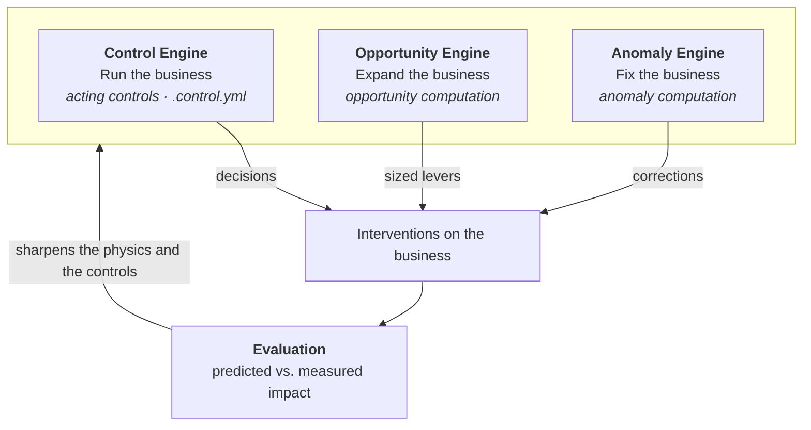

The **World Model** is Oxygen's formula-first model of your business. It
defines every metric that matters as an equation over its drivers, so that
agents and applications can explain why an outcome moved and what to do about
it.

Everything in the World Model fits into two layers:

- The **physics layer** models what the business *is*: its measures and the
  equations that define them, the qualitative map of what drives what, and
  the real objects that produce them.
- The **control layer** models what the business *does*: the versioned
  decision rules that read the physics and move its levers, together with the
  feedback loop of forecasts, evaluation, and calibration that scores every
  change and updates the physics in turn.

<Frame caption="Controls read the physics and act on the business, while the feedback loop of forecasts, evaluation, and calibration scores every intervention and updates the physics.">
  
</Frame>

## A Digital Twin of the physics

Most digital twins model a business from the bottom up, cataloging its atomic
objects (machines, parts, stores) so that operators can monitor each one.
That approach is useful for operational integrity, but it tends to orient you
toward the minutiae rather than the outcomes you are responsible for.

Oxygen builds the twin from the top down instead, starting at the outcome you
are accountable for and modeling downward toward the drivers you can actually
move. The result is a Digital Twin of the business's **outcome physics**: a
set of equations faithful enough to forecast with, backtest against, and use
to change what the business produces. Where a twin of the parts tells you the
state of everything, a twin of the physics tells you what to do.

## The physics layer

The physics layer is built from three components, each of which adds
structure that the one before it cannot express.

### Semantic Model: the vocabulary

The [Semantic Model](/guide/build/semantic-model/simple-model) defines your
business's **measures** and **dimensions** once, in version-controlled
`.view.yml` files, and compiles them into deterministic, correct SQL. Joins
resolve automatically from entity definitions and fan-out is detected and
neutralized, which means `labor_cost_pct` carries the same meaning everywhere
and no agent ever has to hand-write a query to compute it.

```yaml
# sales.view.yml
measures:
  - name: net_sales
    type: sum
    expr: amount
  - name: labor_cost_pct
    type: number
    expr: "{{sales.labor_cost}} / NULLIF({{sales.net_sales}}, 0)"

dimensions:
  - name: location
    type: string
    expr: location
```

This is the deterministic foundation of everything above it, turning business
logic into correct SQL.
[Learn about the Semantic Model →](/guide/build/semantic-model/simple-model)

<Info>
The semantic model is compiled by **[airlayer](https://github.com/oxy-hq/airlayer)**,
the open-source, in-process semantic engine at the core of the World Model.
Because there is no LLM in its compilation path, the same request always
produces the same SQL, and the same definitions compile to BigQuery,
Snowflake, Postgres, DuckDB, and other dialects. airlayer runs as a library
or CLI, so you can embed it, script it, or call it from your own agents
without running a separate service.
</Info>

### Metric Tree: the relationships

While a single measure is only a fact, the **Metric Tree** captures how
measures relate to one another, so that a top-line metric decomposes into the
driver metrics that explain it. Measures compose in two ways:

- **Component edges** are implicit, parsed from `{{view.measure}}` references:
  `arr` depends on `net_mrr`, which in turn depends on `total_mrr` and
  `churned_mrr`. Because these are arithmetic identities, they are exact by
  construction.
- **Driver edges** are explicit `drivers:` annotations that encode the causal
  map, stating which measures push a target up or down and in which
  direction. They are deliberately qualitative, since magnitudes are learned
  at the control layer, where interventions can identify them.

```yaml
measures:
  - name: arr
    type: number
    expr: "{{revenue.net_mrr}} * 12"
    drivers:
      - measure: revenue.churn_rate
        direction: negative
        description: "Higher churn directly reduces ARR"
```

Because the tree knows how every metric is built, it can decompose a change
from the outcome down to the drivers responsible for it, which is what powers
root cause analysis and scenario prediction.
[Learn about the Metric Tree →](/guide/build/world-model/metric-tree)

### Entity Graph: the objects

The **Entity Graph** links measures to the real objects that produce them,
such as stores, employees, customers, and orders, through `entities`
declarations (`primary` and `foreign` keys) and a `parent:` hierarchy.

```yaml
# stores.view.yml
entities:
  - name: store_id
    type: primary
    key: store_id
    parent: company_id
```

Two capabilities follow from this:

- **Automatic joins.** Any measure can be sliced by the dimensions of any
  related object, because the graph already knows the path between them.
- **Promotion up the hierarchy.** A measure defined at the sale grain rolls up
  to the store, company, and market automatically, so `markets.net_sales` is
  derived from `sales.net_sales` without any additional definition.

Grounding metrics in real objects is also what makes them actionable, since
an object is something you can act on.

## The control layer

Where the physics layer describes the machine, the control layer runs it.

### Controls: the decisions

A [control](/guide/build/world-model/controls) codifies a standing practice,
such as "reorder before a SKU runs out," as two declarations: **criteria**
that state when to act, and an **action** that states what to do, whether
that means informing people or acting on the business directly. The criteria
are first-class computations over the physics layer (an anomaly, an
opportunity, or a trigger), and because both declarations are written in
World Model terms, any control can be backtested against your own history.
[Learn about Controls →](/guide/build/world-model/controls)

### Three engines, one rotation

Operating a company comes down to three standing jobs, and Oxygen builds an
engine for each of them:

- **Run the business with the [Control Engine](/guide/build/world-model/controls),**
  which executes the acting controls the company operates by (replenishing,
  staffing, pricing, escalating), each administered as a `.control.yml` file.
- **Expand the business with the [Opportunity Engine](/guide/build/world-model/opportunity-sizing),**
  which runs controls built on the `opportunity` computation to find where
  the business underperforms its own benchmark, size the gap in dollars, and
  drill down to the levers that close it.
- **Fix the business with the Anomaly Engine,** which runs controls built on
  the `anomaly` computation to detect when an outcome breaks from its
  forecast and to decompose that break to its root cause in the Insights
  Inbox.

All three run the same primitive, a
[control](/guide/build/world-model/controls), and differ only in which
criteria computation they use and whether their action informs or acts.



Each engine applies the same four-step discipline over the World Model:

| | **Control Engine**: run | **Opportunity Engine**: expand | **Anomaly Engine**: fix |
| --- | --- | --- | --- |
| **Measure** | Operational metrics at the decision grain (SKU-level sales, days of supply) | Top-line KPIs across every dimension and driver cut | Core output metrics, continuously |
| **Analyze** | Forecast expected demand, depletion, and arrivals | Benchmark comparison, statistically gated | Deviation from the expected envelope, decomposed to root cause |
| **Recommend** | The decision the rule prescribes, such as ordering 40 units today | The levers with the largest sized gap | The levers that reverse the break |

### The feedback loop

Acting is only half of the control layer. The other half scores what each
action did and feeds the result back into the machine, in three steps.

**Forecasts** supply the expected values that criteria compare against. Every
measure with enough history receives a trajectory with a confidence envelope,
produced by seasonal models running over the same semantic definitions.

[**Evaluation**](/guide/build/world-model/evaluation) then measures what each
change actually did. Because controls are versioned, every change has a
before and an after, and the pre/post comparison derives from the control's
own definition rather than from a hand-built analysis. A proposed version can
be backtested before it is adopted, and each firing of its criteria can be
priced against a declared counterfactual measure. Evaluation is also where
driver magnitudes are learned: while the physics knows what drives what, a
control learns how much by acting.
[Learn about Evaluation →](/guide/build/world-model/evaluation)

Finally, [**Calibration**](/guide/build/world-model/calibration) writes those
results back into the physics. Forecasts refit on new history, lags and
structural claims are checked against outcomes, and observational estimates
remain labeled as the weaker kind of claim, so the physics that the next
decision runs on is sharper than the last.
[Learn about Calibration →](/guide/build/world-model/calibration)

As an example, the Anomaly Engine opening up `labor_cost_pct` for a location
might read:

```text
Labor cost: 37.5%  (13% lower than average)

Root cause
  revenue          +25% vs average
  labor            +50% vs average
  employees        ~ average
  full-time hours  ~ average
  overtime hours   +100% vs average

Estimated adjustment:  $250k labor cost
Recommendation:        investigate overtime cost at the San Mateo location
```

## Next steps

<CardGroup cols={2}>
  <Card title="Semantic Model" icon="cube" href="/guide/build/semantic-model/simple-model">
    Define measures, dimensions, and entities
  </Card>
  <Card title="Controls" icon="sliders" href="/guide/build/world-model/controls">
    Codify the practices the business runs on
  </Card>
  <Card title="Evaluation" icon="scale-balanced" href="/guide/build/world-model/evaluation">
    Version comparison and criteria-triggered measurement
  </Card>
  <Card title="Calibration" icon="code-compare" href="/guide/build/world-model/calibration">
    How the feedback loop keeps the physics accurate
  </Card>
</CardGroup>
