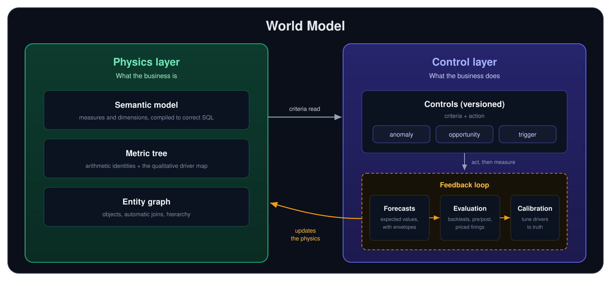

The **World Model** is Oxygen's formula-first model of your business. It
defines every metric that matters as an equation over its drivers, so that
agents and applications can explain why an outcome moved and what to do about
it.

Everything in the World Model fits into two layers:

- The **physics layer** models what the business *is*: its measures and the
  equations that define them, the qualitative map of what drives what, and
  the real objects that produce them.
- The **control layer** models what the business *does*: the versioned
  decision rules that read the physics and move its levers, together with the
  feedback loop of forecasts, evaluation, and calibration that scores every
  change and updates the physics in turn.

<Frame caption="Controls read the physics and act on the business, while the feedback loop of forecasts, evaluation, and calibration scores every intervention and updates the physics.">
  
</Frame>

## A Digital Twin of the physics

Most digital twins model a business from the bottom up, cataloging its
machines, parts, and stores so that operators can monitor each one. Oxygen
builds the twin from the top down instead, starting at the outcome you are
accountable for and modeling downward toward the drivers you can actually
move. The result is a set of equations faithful enough to forecast with,
backtest against, and use to change what the business produces. Where a twin
of the parts tells you the state of everything, a twin of the physics tells
you what to do.

## The physics layer

- **[Semantic Model](/guide/build/semantic-model/simple-model): the
  vocabulary.** Measures and dimensions are defined once and compiled into
  correct SQL by [airlayer](https://github.com/oxy-hq/airlayer), with no LLM
  in the compilation path, so the same request always produces the same
  SQL.
- **[Metric Tree](/guide/build/world-model/metric-tree): the relationships.**
  Every top-line metric decomposes into the drivers that explain it, which
  powers root-cause analysis and scenario prediction.
- **[Entity Graph](/guide/build/semantic-model/entities#the-entity-graph): the
  objects.** Measures are tied to the stores, employees, customers, and orders
  that produce them, so any metric can be sliced, rolled up, and acted on.

## The control layer

A [control](/guide/build/world-model/controls) codifies a standing practice,
such as "reorder before a SKU runs out," as **criteria** that state when to
act and an **action** that states what to do. Because both are written in
World Model terms, every control can be backtested against your own history.
The same primitive powers three engines:

- The **Control Engine** *runs* the business, executing the decisions the
  company operates by, such as replenishing, staffing, and pricing.
- The **[Opportunity Engine](/guide/build/world-model/opportunity-sizing)**
  *expands* it, finding where the business underperforms its own benchmark
  and sizing the gap in dollars.
- The **Anomaly Engine** *fixes* it, detecting when an outcome breaks from its
  forecast and tracing the break to its root cause.

Every action then feeds a loop: **forecasts** set the expected value,
[**evaluation**](/guide/build/world-model/evaluation) measures what each
change actually did, and [**calibration**](/guide/build/world-model/calibration)
writes the result back, so the physics the next decision runs on is sharper
than the last.

## Next steps

<CardGroup cols={2}>
  <Card title="Semantic Model" icon="cube" href="/guide/build/semantic-model/simple-model">
    Define measures, dimensions, and entities
  </Card>
  <Card title="Controls" icon="sliders" href="/guide/build/world-model/controls">
    Codify the practices the business runs on
  </Card>
  <Card title="Evaluation" icon="scale-balanced" href="/guide/build/world-model/evaluation">
    Version comparison and criteria-triggered measurement
  </Card>
  <Card title="Calibration" icon="code-compare" href="/guide/build/world-model/calibration">
    How the feedback loop keeps the physics accurate
  </Card>
</CardGroup>
